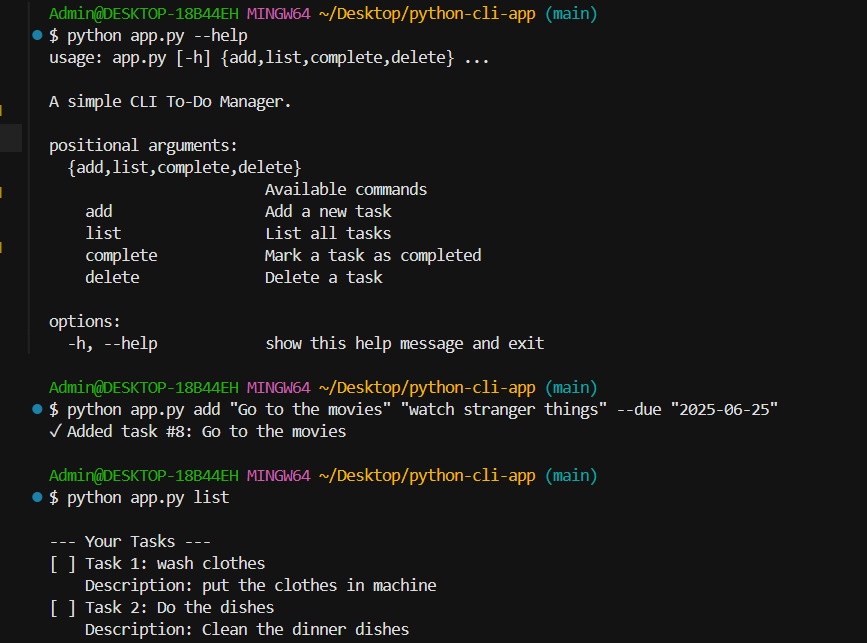
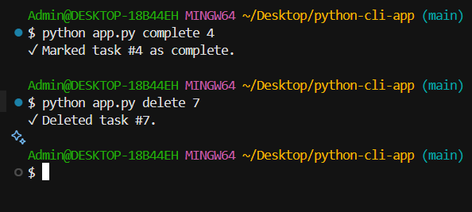

# PYTHON CLI TO-DO APP
    Documentation:
    This file provides an overview of a simple Command-line To-do List app manager built with Python. This tool lets you add, view, complete and delete daily tasks.
    This file contains instructions and information on how to use, install the application.
    Refer to this README for setup steps, usage examples, and additional resources.

## Features

- Add new tasks to your to-do list from the command line.
- View all pending and completed tasks.
- Mark tasks as completed or delete them.
- Persist data in 'tasks.json'
- Lightweight and easy to install.
## Installation and Setup

1. **Clone the repository:**
    ```bash
    git clone https://github.com/Ushindisidi/python-cli-todo-app.git
    cd python-cli-todo-app
    ```

2. **Create a virtual environment (optional but recommended):**
    ```bash
    python -m venv venv
    source venv/Scripts/activate 
    ```

4. **Run the application:**
    ```bash
    python app.py
    ```
## Example Usage
Here are some common commands you can use with the Python CLI To-Do App:

- **Add a new task:**
    ```bash
    python app.py add "Title" "Description"
    ```
    

- **List all tasks:**
    ```bash
    python app.py list
    ```

- **Mark a task as completed:**
    ```bash
    python app.py complete 1
    ```

- **Delete a task:**
    ```bash
    python app.py delete 1
    ```
- **View help:**
    ```bash
    python app.py --help
    ```

##screenshots



##Skills demonstrated
- python OOP
- CLI input parsing
- file I/O and JSON handling
## Requirements
python 3.10+
## Author
Created by Ushindi Sidi❤